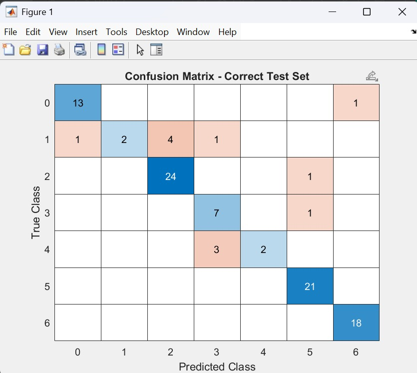

# Compound-Facial-Emotion-Recognition-Analysis-GUI

A MATLAB-based system for real-time **compound facial emotion recognition**, leveraging a custom-built dataset, deep learning (CNN), and a GUI interface with webcam support.

---

## 🧠 Project Overview

This project follows a full machine learning pipeline:
1. **Data Preprocessing** – Prepares grayscale facial images from a custom Compound_Emotion dataset.
2. **Model Training** – Trains a lightweight CNN to classify compound emotions.
3. **Real-Time GUI** – Deploys the model in a MATLAB-based GUI using a webcam for live emotion detection.

---

## 📁 Project Structure

| File | Description |
|------|-------------|
| `compound DATA.ipynb` | Prepares dataset: resizes, normalizes, labels images by emotion class |
| `compound_emotion_cleaned.mat` | Final dataset split into train/val/test (80/10/10) |
| `model train.mlx` | MATLAB code to train CNN using data augmentation, Adam optimizer, and early stopping |
| `EmotionRecognitionModel.mat` | Trained CNN model |
| `EMOTION_DETECTION_GUI_APP.m` / `emotionRecognitionLive` | Real-time GUI app for webcam-based emotion detection |
| `accuracy.jpg`, `confusion.jpg`, `training chart.jpg` | Visual evaluation of model performance |
| `data normalization,reduction.ipynb` | Data transformation (e.g., PCA, scaling) |
| `EmotionRecognitionModel2.mat` | Alternative model version for experimentation |

---

## 🔬 Custom Dataset Creation

- Source: Folder-structured dataset with grayscale images per emotion class.
- Processing:
  - Resize and normalize each image.
  - Assign labels based on folder names (e.g., "Happily Surprised", "Angrily Disgusted").
  - Split into **80% training**, **10% validation**, **10% test**.
- Output: Saved as `compound_emotion_cleaned.mat` for easy loading.

---

## 🧠 CNN Model Training

- Framework: MATLAB
- Input: `compound_emotion_cleaned.mat`
- Key Features:
  - Data augmentation (rotation, flips)
  - Compact CNN (3 layers: Conv → ReLU → Pool)
  - Optimizer: Adam
  - Early stopping, L2 regularization
  - Confusion matrix and accuracy computed on test set
- Output: `EmotionRecognitionModel.mat`

### 📊 Accuracy Visualization

### 🔄 Confusion Matrix

### 📈 Training Progress Chart

---

## 🖥️ Real-Time Emotion Detection GUI

The `emotionRecognitionLive` function is a live detection system with:
- 📷 **Webcam feed** capture and face detection
- 🧠 **CNN-based emotion classification**
- 📍 **Landmark-based inference** for robustness
- 💬 **Optional Text-to-Speech** for detected emotions
- 📊 **Confidence bars** + emotion label
- 😊 **Emoji rendering** for visual feedback
- 🎨 **Color-coded UI** based on emotion
- 📸 **Screenshot capture** functionality

---

## ▶️ Getting Started

### 📦 Requirements
- MATLAB R2021a+ (Deep Learning Toolbox recommended)
- Webcam
- Windows/macOS/Linux

### 🚀 How to Run
1. Launch MATLAB.
2. Open and run: `EMOTION_DETECTION_GUI_APP.m`
3. Ensure webcam permissions are granted.
4. Observe real-time emotion detection and visualization.

---

## 💡 Future Enhancements

- Expand compound emotion classes with more nuanced categories
- Improve landmark-based inference with DLIB or MediaPipe integration
- Port model to Python (e.g., using TensorFlow.js or OpenCV GUI)

---

## 🧾 License

This project is for academic and non-commercial use only. Please cite the author if used in publications or projects.

---

## 👤 Author

**Ayush Singh**  
GitHub: [@ayushsingh08-ds](https://github.com/ayushsingh08-ds)
